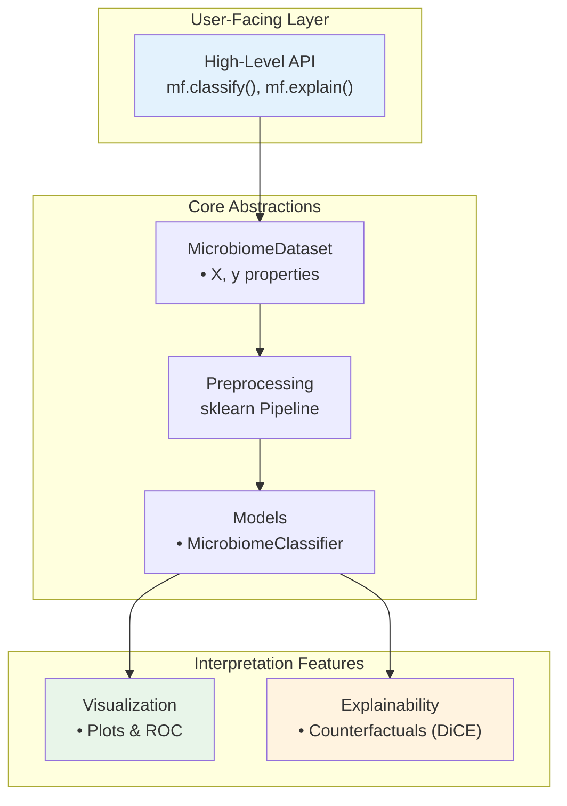

# MicroFactual

[](https://www.python.org/downloads/)
[](https://opensource.org/licenses/MIT)
[](https://github.com/simeonhebrew/ML_Microbiome_Package/actions/workflows/ci.yml)

**Interpretable, sklearn-native counterfactual explanations for microbiome classification.**

MicroFactual answers a question most microbiome ML tools can't: *"what minimal change in taxa abundance would flip this sample's prediction?"* It pairs per-sample counterfactual analysis with a clean sklearn-compatible surface (`Pipeline`, `GridSearchCV`, `cross_val_score`) over microbiome-aware preprocessing (abundance/prevalence filtering, CLR).

**Non-goals:** not a replacement for QIIME2's bioinformatics pipeline, not a feature-engineering toolkit, not a diversity/phylogenetics library.

## Features

- 🧬 **Microbiome-optimized preprocessing** — Abundance filtering, prevalence filtering, CLR transformation
- 📊 **Rich Visualization** — ROC curves, Confusion Matrices, Feature Importance plots
- 🧠 **Explainable AI** — Counterfactual explanations via DiCE integration
- 🤖 **sklearn-compatible** — Works with `cross_val_score`, `Pipeline`, `GridSearchCV`
- 📈 **One-liner API** — Run complete workflows in a single function call
- 🔬 **Built for researchers** — Sensible defaults, minimal boilerplate

## Architecture



## Installation

```bash
# Core install (lean — preprocessing, models, visualization)
pip install -e .

# With the interpretability stack (DiCE counterfactuals + ExplainerDashboard)
pip install -e '.[explainability]'

# Using uv (recommended)
uv pip install -e '.[explainability]'
```

Requires Python 3.10+. The `explainability` extra pulls in the heavier
`dice-ml` and `explainerdashboard` dependencies; the core install stays lean.

## Quick Start

### One-Line Classification

```python
import microfactual as mf

results = mf.classify(
    "data/abundance.tsv",
    "data/metadata.tsv",
    target_column="disease"
)

print(f"CV Accuracy: {results['cv_scores']['test_accuracy']:.3f}")
```

### sklearn-Compatible API

```python
from microfactual import MicrobiomeClassifier, MicrobiomeDataset
from sklearn.model_selection import cross_val_score

# Load data
dataset = MicrobiomeDataset.from_files(
    "data/abundance.tsv",
    "data/metadata.tsv",
    target_column="disease"
)

# Train classifier
clf = MicrobiomeClassifier(algorithm="random_forest")
scores = cross_val_score(clf, dataset.X, dataset.y, cv=5)
```

### Custom Preprocessing

```python
from microfactual import (
    MicrobiomeClassifier,
    AbundanceFilter,
    PrevalenceFilter,
    CLRTransform
)

clf = MicrobiomeClassifier(
    algorithm="logistic",
    preprocessing=[
        AbundanceFilter(min_abundance=0.01),
        PrevalenceFilter(min_prevalence=0.1),
        CLRTransform()
    ]
)
clf.fit(X, y)
```

## CLI Usage

```bash
microfactual \
    --abundance data/abundance.tsv \
    --metadata data/metadata.tsv \
    --target disease \
    --output_dir results/
```

## API Reference

### High-Level

| Function | Description |
|----------|-------------|
| `mf.classify()` | One-liner classification pipeline |

### Core Classes

| Class | Description |
|-------|-------------|
| `MicrobiomeDataset` | Data container with `X`, `y` properties |
| `MicrobiomeClassifier` | Classifier with built-in preprocessing |

### Preprocessing Transforms

All transforms are sklearn-compatible (`fit`/`transform`):

| Transform | Description |
|-----------|-------------|
| `AbundanceFilter` | Remove low-abundance features |
| `PrevalenceFilter` | Remove rare features |
| `CLRTransform` | Centered log-ratio transformation |

### Visualization

| Function | Description |
|----------|-------------|
| `mf.plot_roc()` | Plot ROC curve with AUC score |
| `mf.plot_confusion_matrix()` | Plot confusion matrix with labels |
| `mf.plot_feature_importance()` | Plot top feature importances |
| `mf.launch_dashboard()` | Launch interactive ExplainerDashboard |

### Explainability

| Class/Function | Description |
|----------------|-------------|
| `DiCEExplainer` | Generate counterfactual explanations |
| `BaseExplainer` | Abstract base class for custom explainers |

## Development

```bash
# Install dev dependencies
uv pip install -e ".[dev]"

# Run tests
make test

# Run linting
ruff check src/
```

## Roadmap

- [ ] First-class `explain_counterfactual()` API and methodology docs
- [ ] Additional classifiers (XGBoost, SVM)
- [ ] Optional `[explainability]` extras to keep the core install lean
- [ ] Real-dataset benchmark notebook (AUC/F1 vs. baseline)
- [ ] BIOM file format support
- [ ] SHAP integration

## License

MIT License - see [LICENSE](LICENSE) for details.

## Citation

If you use MicroFactual in your research, please cite:

```bibtex
@software{microfactual,
  title = {MicroFactual: Interpretable Microbiome ML},
  author = {Hebrew, Simeon and Adu-Gyamfi, Lawrence},
  year = {2025},
  url = {https://github.com/simeonhebrew/ML_Microbiome_Package}
}
```
