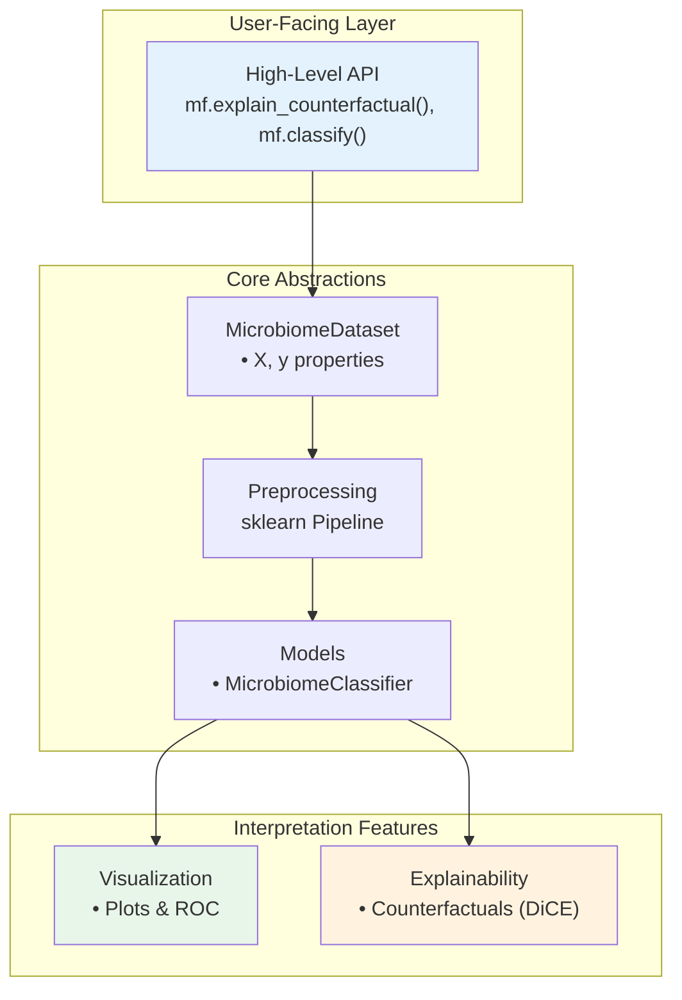

# MicroFactual

[](https://www.python.org/downloads/)
[](https://opensource.org/licenses/MIT)
[](https://github.com/simeonhebrew/MicroFactual/actions/workflows/ci.yml)
[](https://simeonhebrew.github.io/MicroFactual/)

**Interpretable, sklearn-native counterfactual explanations for microbiome classification.**

📖 **[Documentation](https://simeonhebrew.github.io/MicroFactual/)** — quickstart, counterfactuals guide, preprocessing rationale, and API reference.

MicroFactual answers a question most microbiome ML tools can't: *"what minimal change in taxa abundance would flip this sample's prediction?"* It pairs per-sample counterfactual analysis with a clean sklearn-compatible surface (`Pipeline`, `GridSearchCV`, `cross_val_score`) over microbiome-aware preprocessing (abundance/prevalence filtering, CLR).

**Non-goals:** not a replacement for QIIME2's bioinformatics pipeline, not a feature-engineering toolkit, not a diversity/phylogenetics library.

## Features

- 🧠 **Counterfactual explanations** — Sparse, validated, per-sample "what would flip this prediction?" with real taxon names, plausibility bounds, cohort ranking, and a class-reference heatmap
- 🧬 **Microbiome-optimized preprocessing** — Abundance filtering, prevalence filtering, CLR transformation
- 🔎 **Data exploration** — Cutoff-diagnostic plots (`mf.explore`) to choose filters from the data
- 📊 **Rich visualization** — ROC curves, confusion matrices, feature importance
- 🤖 **sklearn-compatible** — Works with `cross_val_score`, `Pipeline`, `GridSearchCV`
- 📈 **One-liner API** — Run a complete classification workflow in a single call

## Architecture



## Installation

```bash
# Core install (lean — preprocessing, models, visualization)
pip install -e .

# With the counterfactual explainability stack (DiCE)
pip install -e '.[explainability]'

# Using uv (recommended)
uv pip install -e '.[explainability]'
```

Requires Python 3.10+. The `explainability` extra pulls in the heavier `dice-ml`
dependency for counterfactuals; the core install stays lean.

## Quick Start

### Counterfactual explanations (the headline)

*"What is the smallest change in taxa abundance that would flip this sample's
prediction?"* — answered per sample, with the real taxon names.

```python
import microfactual as mf
from microfactual import AbundanceFilter, PrevalenceFilter, CLRTransform

# 1. Load a real feature table + metadata
ds = mf.MicrobiomeDataset.from_files(
    "abundance.tsv", "metadata.tsv",
    target_column="Group", sample_column="Sample ID",
)

# 2. Preprocess into CLR space (real taxon names are preserved end-to-end)
X = CLRTransform().fit_transform(
    PrevalenceFilter(min_prevalence=0.1).fit_transform(
        AbundanceFilter(min_abundance=1e-5).fit_transform(ds.X)))
y = ds.y

# 3. Fit an sklearn-compatible classifier in that space
model = mf.MicrobiomeClassifier(preprocessing=None).fit(X, y)

# 4. Explain one sample: what minimal change flips its prediction?
cf = mf.explain_counterfactual(
    model, X.iloc[[0]], background_data=X, y=y,
    class_names=list(ds.target_names),
)
print(cf.summary())
cf.changes(0)   # tidy table: taxon, original -> counterfactual, delta, direction
```

By default the result is **sparse** (a handful of taxa, not hundreds) and
**validated** (each counterfactual really flips the prediction). Illustrative
output on the shipped colorectal-cancer dataset:

```text
1 counterfactual(s) flipping CRC → Control; features changed: 7; validity=100%.

                       feature  original  counterfactual  delta  direction
   Bacteroides fragilis [1090]      5.98           -1.83  -7.81   decrease
Methanosphaera stadtmanae [94]     -3.21            3.18   6.39   increase
    Bacteroides caccae [1096]      -0.43            4.70   5.13   increase
   ...                                                    (7 taxa total)
```

Go further: keep counterfactuals in-distribution with
`mf.plausible_range(...)` + `permitted_range`, rank taxa across a cohort with
`mf.counterfactual_importance(...)`, and visualize a counterfactual against the
class references with `mf.plot_counterfactual_heatmap(...)`. See
[`notebooks/00_End_to_End_Feature_Tour.ipynb`](notebooks/00_End_to_End_Feature_Tour.ipynb).

### One-line classification

```python
import microfactual as mf

results = mf.classify(
    "data/abundance.tsv",
    "data/metadata.tsv",
    target_column="disease"
)

print(f"CV Accuracy: {results['cv_scores']['test_accuracy']:.3f}")
```

### sklearn-Compatible API

```python
from microfactual import MicrobiomeClassifier, MicrobiomeDataset
from sklearn.model_selection import cross_val_score

# Load data
dataset = MicrobiomeDataset.from_files(
    "data/abundance.tsv",
    "data/metadata.tsv",
    target_column="disease"
)

# Train classifier
clf = MicrobiomeClassifier(algorithm="random_forest")
scores = cross_val_score(clf, dataset.X, dataset.y, cv=5)
```

### Custom Preprocessing

```python
from microfactual import (
    MicrobiomeClassifier,
    AbundanceFilter,
    PrevalenceFilter,
    CLRTransform
)

clf = MicrobiomeClassifier(
    algorithm="logistic",
    preprocessing=[
        AbundanceFilter(min_abundance=0.01),
        PrevalenceFilter(min_prevalence=0.1),
        CLRTransform()
    ]
)
clf.fit(X, y)
```

## CLI Usage

```bash
microfactual \
    --abundance data/abundance.tsv \
    --metadata data/metadata.tsv \
    --target disease \
    --output_dir results/
```

## API Reference

### High-Level

| Function | Description |
|----------|-------------|
| `mf.explain_counterfactual()` | Sparse, validated per-sample counterfactuals (returns a `CounterfactualResult`) |
| `mf.classify()` | One-liner classification pipeline |

### Core Classes

| Class | Description |
|-------|-------------|
| `MicrobiomeDataset` | Data container with `X`, `y` properties |
| `MicrobiomeClassifier` | Classifier with built-in preprocessing |

### Preprocessing Transforms

All transforms are sklearn-compatible (`fit`/`transform`):

| Transform | Description |
|-----------|-------------|
| `AbundanceFilter` | Remove low-abundance features |
| `PrevalenceFilter` | Remove rare features |
| `CLRTransform` | Centered log-ratio transformation |

### Data Exploration

| Function | Description |
|----------|-------------|
| `mf.explore()` | Cutoff-diagnostics panel (abundance/prevalence histograms + joint scatter) |
| `mf.plot_abundance_histogram()` | Per-taxon mean-abundance histogram (log scale) |
| `mf.plot_prevalence_histogram()` | Per-taxon prevalence histogram |
| `mf.plot_prevalence_abundance()` | Joint prevalence-vs-abundance scatter with cutoffs |

### Visualization

| Function | Description |
|----------|-------------|
| `mf.plot_roc()` | Plot ROC curve with AUC score |
| `mf.plot_confusion_matrix()` | Plot confusion matrix with labels |
| `mf.plot_feature_importance()` | Plot top feature importances |
| `mf.plot_counterfactual_heatmap()` | Heatmap of a counterfactual vs class references |

### Explainability

| Class/Function | Description |
|----------------|-------------|
| `mf.explain_counterfactual()` | Sparse, validated counterfactuals → `CounterfactualResult` |
| `mf.counterfactual_importance()` | Cohort-level taxon ranking by how often they must change |
| `mf.plausible_range()` | Reference-class bounds for `permitted_range` (keeps CFs in-distribution) |
| `mf.counterfactual_concordance()` | Score how well a counterfactual moves toward a reference class |
| `CounterfactualResult` | `.changes()`, `.n_changes`, `.validity`, `.summary()` |
| `DiCEExplainer` / `BaseExplainer` | Low-level DiCE adapter / abstract explainer base |

## Development

```bash
# Install dev dependencies
uv pip install -e ".[dev]"

# Run tests
make test

# Run linting
ruff check src/
```

## Roadmap

- [ ] First-class `explain_counterfactual()` API and methodology docs
- [ ] Additional classifiers (XGBoost, SVM)
- [ ] Optional `[explainability]` extras to keep the core install lean
- [ ] Real-dataset benchmark notebook (AUC/F1 vs. baseline)
- [ ] BIOM file format support
- [ ] SHAP integration

## License

MIT License - see [LICENSE](LICENSE) for details.

## Citation

If you use MicroFactual in your research, please cite:

```bibtex
@software{microfactual,
  title = {MicroFactual: Interpretable Microbiome ML},
  author = {Hebrew, Simeon and Adu-Gyamfi, Lawrence},
  year = {2025},
  url = {https://github.com/simeonhebrew/MicroFactual}
}
```
