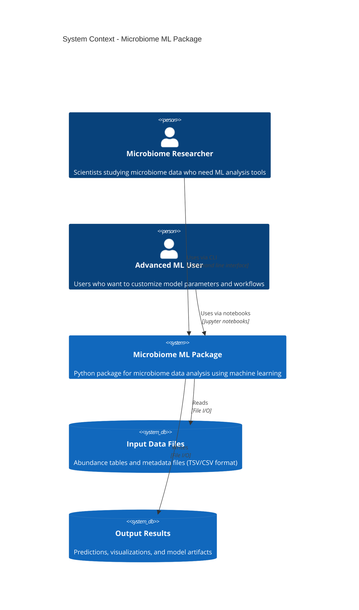
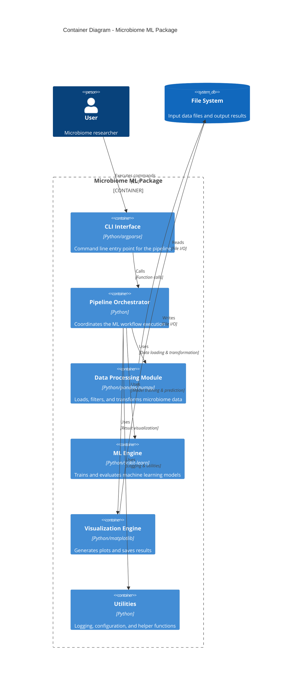
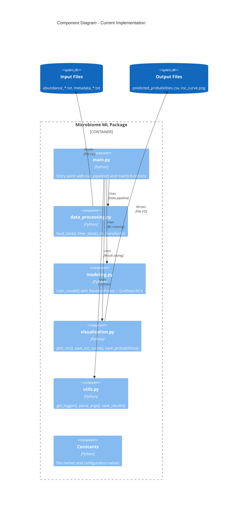
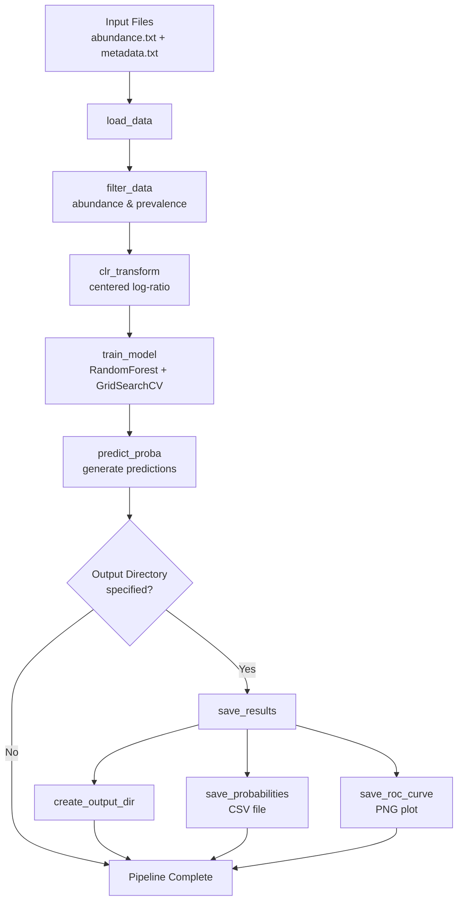

# Current Architecture - Microbiome ML Package

## System Context Diagram (C4 Level 1)

## Container Diagram (C4 Level 2)

## Component Diagram (C4 Level 3) - Current Implementation

## Data Flow Diagram

