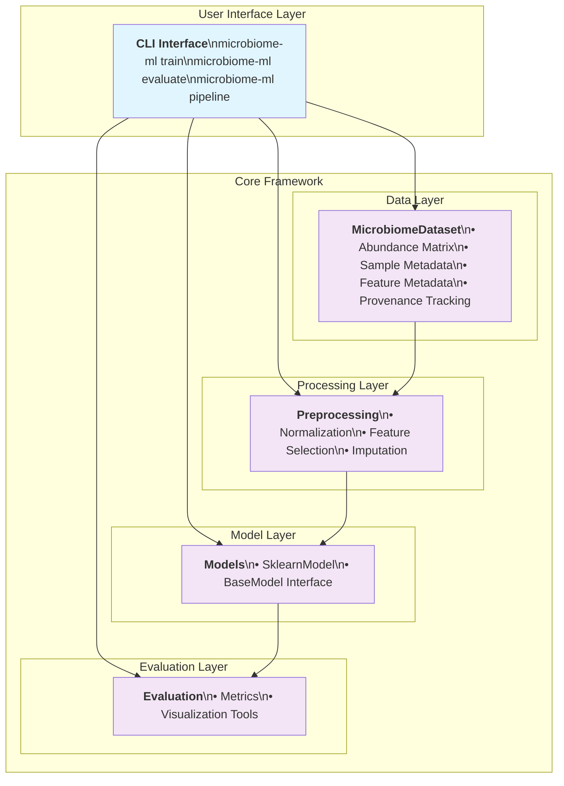
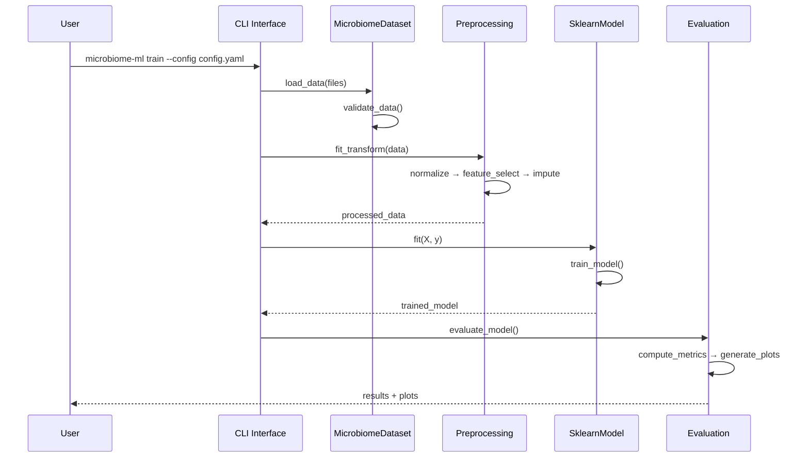
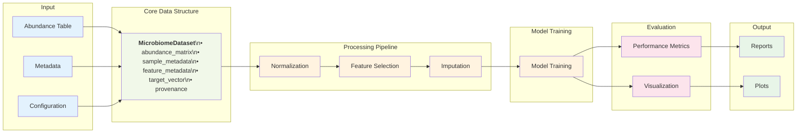

# MicroML: Proposed Architecture

## Architecture Overview

The architecture is designed to provide a modular, extensible, and user-friendly framework for microbiome machine learning tasks. The simplified approach focuses on:
- **Data Handling**: Centralized management of microbiome datasets.
- **Preprocessing**: Configurable pipelines for data transformation.
- **Modeling**: Scikit-learn backend with extensibility for future frameworks.
- **Evaluation**: Standardized metrics and visualization tools.
- **CLI Integration**: Streamlined commands for end-to-end workflows.



## Component Interaction Flow



## Data Flow Architecture



## Directory Structure

```
ML_Microbiome_Package/
├── datasets/                # Example datasets
│   ├── abundance_crc.txt
│   ├── metadata_crc.txt
│   └── NSCLC_Dataset/
├── docs/                    # Documentation
│   ├── architecture_proposed.md
│   ├── development_guidelines.md
│   └── user_guide.rst
├── env_microbiome/          # Python virtual environment
├── notebooks/               # Jupyter notebooks for examples
│   ├── counterfactuals_example.ipynb
│   └── explainerboard_visualisation.ipynb
├── scripts/                 # Utility scripts
├── src/                     # Source code
│   ├── microbiome_ml/       # Core library
│   │   ├── dataset.py       # MicrobiomeDataset class
│   │   ├── preprocessing.py # Preprocessing pipeline
│   │   ├── modeling.py      # BaseModel and SklearnModel
│   │   ├── evaluation.py    # Evaluation metrics
│   │   └── cli.py           # CLI commands
│   └── microfactual/        # Counterfactual analysis
├── test/                    # Unit tests
│   ├── test_data_processing.py
│   ├── test_modeling.py
│   └── test_utils.py
├── pyproject.toml           # Project configuration
├── README.md                # Project overview
└── Makefile                 # Automation commands
```

## Core Architecture Components

### 1. **Core Data Structures** (`microfactual.core`)

**MicroFactualDataset**: Central data structure that encapsulates:
- Abundance matrix (features × samples)
- Sample metadata (demographics, conditions, etc.)
- Feature metadata (taxonomy, functional annotations)
- Data provenance and transformations applied

```python
from microfactual.core import MicroFactualDataset

# Load data
dataset = MicroFactualDataset.from_files(
    abundance="abundance.tsv",
    metadata="metadata.tsv",
    sample_id_col="SampleID",
    feature_id_col="FeatureID"
)

# Access components
X = dataset.abundance_matrix  # samples × features
y = dataset.target_vector     # target variable
metadata = dataset.sample_metadata
```

### 2. **Preprocessing Pipeline** (`microfactual.preprocessing`)

Modular preprocessing components that can be chained:

```python
from microfactual.preprocessing import (
    AbundanceFilter, PrevalenceFilter, CLRTransform,
    VarianceFilter, LogTransform
)
from sklearn.pipeline import Pipeline

# Create preprocessing pipeline
preprocessor = Pipeline([
    ('abundance_filter', AbundanceFilter(min_abundance=1e-6)),
    ('prevalence_filter', PrevalenceFilter(min_prevalence=0.05)),
    ('log_transform', LogTransform(pseudocount=1e-6)),
    ('clr_transform', CLRTransform()),
    ('variance_filter', VarianceFilter(threshold=0.1))
])

# Apply to dataset
X_processed = preprocessor.fit_transform(dataset.abundance_matrix)
```

### 3. **Model Ecosystem** (`microfactual.models`)

Scikit-learn compatible estimators with microbiome-specific enhancements:

```python
from microfactual.models import MicroFactualRandomForest, MicroFactualSVM
from microfactual.evaluation import MicroFactualCV

# Models with built-in preprocessing awareness
model = MicroFactualRandomForest(
    preprocessing='auto',  # Automatic CLR + filtering
    feature_selection='variance',  # Built-in feature selection
    n_estimators=100,
    max_features='sqrt'
)

# Cross-validation with microbiome-aware splits
cv = MicroFactualCV(
    strategy='subject_aware',  # Prevent data leakage across subjects
    n_splits=5,
    test_size=0.2
)

scores = cv.cross_validate(model, dataset, scoring=['accuracy', 'f1'])
```

### 4. **High-Level API** (`microfactual`)

Simple, opinionated interface for common workflows:

```python
import microfactual as mf

# One-liner for classification
results = mf.classify(
    abundance_file="abundance.tsv",
    metadata_file="metadata.tsv",
    target_column="disease_status",
    model="random_forest",
    output_dir="results/"
)

# Pipeline objects for more control
pipeline = mf.ClassificationPipeline(
    preprocessing=['filter', 'clr', 'feature_selection'],
    model='random_forest',
    explainability=['counterfactuals', 'feature_importance'],
    evaluation=['cross_validation', 'permutation_test']
)

pipeline.fit(dataset)
pipeline.evaluate()
pipeline.explain()
pipeline.save_report("results/")
```

### 5. **Explainability Module** (`microfactual.explainability`)

Interpretation methods tailored for microbiome data:

```python
from microfactual.explainability import (
    MicroFactualCounterfactuals,
    TaxonomicImportance,
    BiomarkerDiscovery
)

# Counterfactual explanations
cf_explainer = MicroFactualCounterfactuals(
    model=trained_model,
    feature_constraints='taxonomic_coherence',  # Respect taxonomic relationships
    diversity_weight=1.0
)

counterfactuals = cf_explainer.explain(
    query_samples=test_samples[:5],
    desired_class='healthy'
)

# Feature importance with taxonomic aggregation
importance = TaxonomicImportance(model=trained_model)
importance.plot_by_taxonomy_level(level='genus')
```

### 6. **CLI Interface** (`microfactual.cli`)

```bash
# Train a model
microfactual train \
    --abundance data/abundance.tsv \
    --metadata data/metadata.tsv \
    --target disease_status \
    --model random_forest \
    --output results/

# Generate explanations
microfactual explain \
    --model results/model.pkl \
    --data data/test_samples.tsv \
    --method counterfactuals \
    --output results/explanations/

# Full pipeline with config
microfactual pipeline --config pipeline_config.yaml
```

## Key Architectural Decisions

### 1. **Layered API Design**
- **High-level**: Simple functions for common tasks (`mf.classify()`)
- **Mid-level**: Pipeline objects for structured workflows
- **Low-level**: Individual components for maximum flexibility

### 2. **Data Structure Centricity**
- `MicroFactualDataset` as the central data abstraction
- Maintains data provenance and metadata throughout pipeline
- Supports multiple data formats (TSV, BIOM, HDF5)

### 3. **Scikit-learn Compatibility**
- All estimators follow sklearn's fit/predict/transform interface
- Compatible with sklearn pipelines, cross-validation, etc.
- Can be used in existing sklearn workflows

### 4. **Domain-Aware Defaults**
- Sensible defaults for microbiome data (CLR transform, prevalence filtering)
- Automatic handling of common microbiome data issues (sparsity, compositionality)
- Built-in validation for microbiome-specific constraints

### 5. **Extensibility Points**
- Plugin architecture for new models and transforms
- Registry system for algorithms and preprocessing methods
- Hook system for custom validation and constraints

## Implementation Strategy

### Phase 1: Core Foundation (Current → 3 months)
1. Implement `MicroFactualDataset` and core data structures
2. Refactor existing preprocessing into modular components
3. Create base estimator classes with sklearn compatibility
4. Migrate current functionality to new architecture

### Phase 2: Model Expansion (3-6 months)
1. Add more algorithms (SVM, XGBoost, Neural Networks)
2. Implement ensemble methods and stacking
3. Add hyperparameter optimization with microbiome-aware search spaces
4. Advanced feature selection and dimensionality reduction

### Phase 3: Explainability & Advanced Features (6-9 months)
1. Integrate DiCE for counterfactual explanations
2. Add SHAP integration with microbiome-specific visualizations

### Phase 4: Ecosystem & Community (9-12 months)
1. Plugin architecture and community contribution framework
2. Integration with other microbiome tools (QIIME2, etc.)
3. Advanced visualization and interactive tools
4. Documentation, tutorials, and case studies

## Benefits of This Architecture

1. **Immediate Value**: Current users can continue using familiar workflows
2. **Growth Path**: Clear expansion points for new features and algorithms
3. **Community Ready**: Plugin architecture enables contributions
4. **Research Friendly**: Built-in experiment tracking and reproducibility
5. **Industry Compatible**: Professional software engineering practices

Would you like me to start implementing this architecture by creating the core components?
